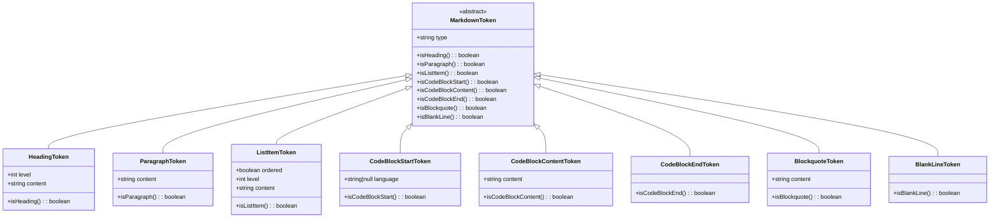
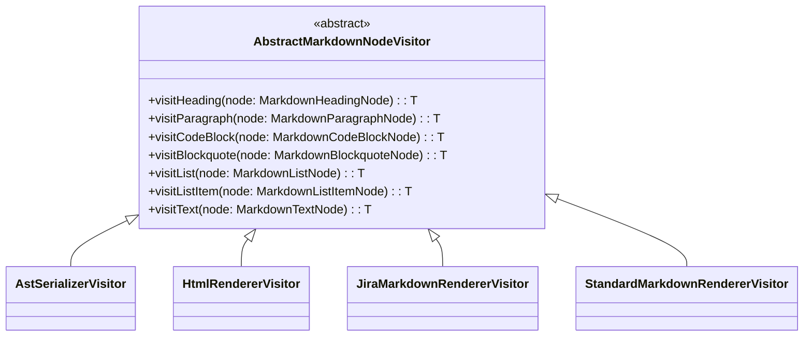

# Markdown Parser モジュール構æˆ

ã“ã®ãƒ‡ã‚£ãƒ¬ã‚¯ãƒˆãƒªã¯ã€æ¨™æº–MarkdownãŠã‚ˆã³Jira記法ã«å¯¾å¿œã—ãŸMarkdownパーサーを構築ã™ã‚‹ãŸã‚ã®ã‚³ãƒ³ãƒãƒ¼ãƒãƒ³ãƒˆç¾¤ã§ã™ã€‚

---

## 処ç†ãƒ•ãƒ­ãƒ¼æ¦‚è¦

Markdownパーサーã¯ã€å…¥åŠ›ã•ã‚ŒãŸMarkdownを解æã—ã€AST（抽象構文木）を生æˆã—ã¦ãƒ¬ãƒ³ãƒ€ãƒªãƒ³ã‚°ã‚„シリアライズを行ã„ã¾ã™ã€‚以下ã«å‡¦ç†ãƒ•ãƒ­ãƒ¼ã‚’示ã—ã¾ã™ã€‚

```mermaid
flowchart TD
    A[Markdown文字列] -->|Lexerã§ãƒˆãƒ¼ã‚¯ãƒ³åŒ–| B[トークン列]
    B -->|Parserã§AST構築| C[ASTãƒãƒ¼ãƒ‰]
    C -->|Visitorã§ãƒ¬ãƒ³ãƒ€ãƒªãƒ³ã‚°| D[Markdown<br>Jira記法<br>HTML]
    C -->|シリアライズ| E[JSONå½¢å¼]
    E -->|デシリアライズ| C

    subgraph パース処ç†
        A
        B
        C
    end

    subgraph レンダリング処ç†
        D
    end

    subgraph シリアライズ処ç†
        E
    end
```

### 処ç†ã®è©³ç´°

1. **パース処ç†**
   - **入力**: Markdownå½¢å¼ã®æ–‡å­—列。
   - **処ç†**:
     1. Lexer（`StandardLexer` ã¾ãŸã¯ `JiraLexer`）を使用ã—ã¦ã€Markdown文字列をトークン列ã«å¤‰æ›ã€‚
     2. Parser（`StandardParser` ã¾ãŸã¯ `JiraParser`）を使用ã—ã¦ã€ãƒˆãƒ¼ã‚¯ãƒ³åˆ—ã‹ã‚‰AST（`MarkdownBlockNode[]`）を構築。
   - **出力**: AST（Markdownã®æ§‹é€ ã‚’表ã™ãƒãƒ¼ãƒ‰ã®é…列）。

2. **レンダリング処ç†**
   - **入力**: AST（`MarkdownBlockNode[]`）。
   - **処ç†**:
     1. Visitorパターンを使用ã—ã¦ã€ASTを特定ã®å½¢å¼ã«å¤‰æ›ã€‚
        - `StandardMarkdownRendererVisitor`: 標準Markdownå½¢å¼ã«å¤‰æ›ã€‚
        - `JiraMarkdownRendererVisitor`: Jira記法ã«å¤‰æ›ã€‚
        - `HtmlRendererVisitor`: HTMLå½¢å¼ã«å¤‰æ›ã€‚
     2. å„ãƒãƒ¼ãƒ‰ã®`accept`メソッドを呼ã³å‡ºã—ã€VisitorãŒãƒãƒ¼ãƒ‰ã‚’処ç†ã€‚
   - **出力**: 指定ã•ã‚ŒãŸå½¢å¼ã®æ–‡å­—列（Markdownã€Jira記法ã€HTML）。

3. **シリアライズ処ç†**
   - **入力**: AST（`MarkdownBlockNode[]`）。
   - **処ç†**:
     1. `AstSerializerVisitor` を使用ã—ã¦ã€ASTをシリアライズå¯èƒ½ãªJSONå½¢å¼ï¼ˆ`SerializedMarkdownNode[]`）ã«å¤‰æ›ã€‚
     2. JSONå½¢å¼ã®ãƒ‡ãƒ¼ã‚¿ã‚’ä¿å­˜ã¾ãŸã¯è»¢é€ã€‚
   - **出力**: JSONå½¢å¼ã®ãƒ‡ãƒ¼ã‚¿ã€‚

4. **デシリアライズ処ç†**
   - **入力**: シリアライズã•ã‚ŒãŸJSONå½¢å¼ã®ãƒ‡ãƒ¼ã‚¿ï¼ˆ`SerializedMarkdownNode[]`）。
   - **処ç†**:
     1. `AstDeserializerVisitor` を使用ã—ã¦ã€JSONデータをAST（`MarkdownBlockNode[]`）ã«å¾©å…ƒã€‚
   - **出力**: AST。

ã“ã®ãƒ•ãƒ­ãƒ¼ã«ã‚ˆã‚Šã€Markdownã®è§£æã€å¤‰æ›ã€ä¿å­˜ã€å¾©å…ƒãŒæŸ”軟ã«è¡Œãˆã‚‹ã‚ˆã†ã«ãªã£ã¦ã„ã¾ã™ã€‚

---

## 📚 構æˆæ¦‚è¦ï¼ˆMermaid図）
### 🔹 トークン構造
Markdown文字列ã®ãƒ‘ース処ç†ã¯ã€ã¾ãš トークン化フェーズ ã‹ã‚‰å§‹ã¾ã‚Šã¾ã™ã€‚
ã“ã®æ®µéšã§ã¯ã€Markdownã®1è¡Œ1行を解æã—ã¦ã€å¯¾å¿œã™ã‚‹æ„味をæŒã£ãŸ MarkdownToken を生æˆã—ã¾ã™ã€‚

å„トークンã¯å…±é€šã®åŸºåº•ã‚¯ãƒ©ã‚¹ MarkdownToken を継承ã—ã¦ãŠã‚Šã€ç¨®é¡ã”ã¨ã®åˆ¤å®šãƒ¡ã‚½ãƒƒãƒ‰ï¼ˆä¾‹: isHeading()）をæŒã£ã¦ã„ã¾ã™ã€‚

```mermaid
classDiagram
    direction TB

    %% トークン（1行目）
    class MarkdownToken {
        <<abstract>>
        +string type
        +isHeading(): boolean
        +isParagraph(): boolean
        +isListItem(): boolean
        +isCodeBlockStart(): boolean
        +isCodeBlockContent(): boolean
        +isCodeBlockEnd(): boolean
        +isBlockquote(): boolean
        +isBlankLine(): boolean
    }

    class HeadingToken {
        +int level
        +string content
        +isHeading(): boolean
    }

    class ParagraphToken {
        +string content
        +isParagraph(): boolean
    }

    class ListItemToken {
        +boolean ordered
        +int level
        +string content
        +isListItem(): boolean
    }

    class CodeBlockStartToken {
        +string|null language
        +isCodeBlockStart(): boolean
    }

    class CodeBlockContentToken {
        +string content
        +isCodeBlockContent(): boolean
    }

    class CodeBlockEndToken {
        +isCodeBlockEnd(): boolean
    }

    class BlockquoteToken {
        +string content
        +isBlockquote(): boolean
    }

    class BlankLineToken {
        +isBlankLine(): boolean
    }

    %% 継承関係
    MarkdownToken <|-- HeadingToken
    MarkdownToken <|-- ParagraphToken
    MarkdownToken <|-- ListItemToken
    MarkdownToken <|-- CodeBlockStartToken
    MarkdownToken <|-- CodeBlockContentToken
    MarkdownToken <|-- CodeBlockEndToken
    MarkdownToken <|-- BlockquoteToken
    MarkdownToken <|-- BlankLineToken
```

#### 主ãªãƒˆãƒ¼ã‚¯ãƒ³ã®ç¨®é¡ï¼š
| トークン種別                  | èª¬æ˜                               |
| ----------------------- | -------------------------------- |
| `HeadingToken`          | `# 見出ã—` ã«è©²å½“ã™ã‚‹è¡Œã€‚レベルやテキスト内容をä¿æŒã—ã¾ã™ã€‚ |
| `ParagraphToken`        | 通常ã®ãƒ†ã‚­ã‚¹ãƒˆè¡Œã€‚段è½ã¨ã—ã¦æ‰±ã‚れる行を対象ã¨ã—ã¾ã™ã€‚      |
| `ListItemToken`         | `- リスト` ã‚„ `1. 番å·ä»˜ãリスト` ã«è©²å½“ã™ã‚‹è¡Œã€‚   |
| `CodeBlockStartToken`   | \`\`\`\`\` ãªã©ã‚³ãƒ¼ãƒ‰ãƒ–ロックã®é–‹å§‹ã‚’示ã™è¡Œã€‚     |
| `CodeBlockContentToken` | コードブロック内部ã®1行。                    |
| `CodeBlockEndToken`     | コードブロックã®çµ‚了を示ã™è¡Œã€‚                  |
| `BlockquoteToken`       | `> 引用` ã«è©²å½“ã™ã‚‹è¡Œã€‚                   |
| `BlankLineToken`        | 空行。段è½ã‚„構造ã®åŒºåˆ‡ã‚Šã¨ã—ã¦æ‰±ã‚ã‚Œã¾ã™ã€‚            |

### 🔸 ASTãƒãƒ¼ãƒ‰æ§‹é€ 
トークン列ã‹ã‚‰æ§‹ç¯‰ã•ã‚ŒãŸãƒ‡ãƒ¼ã‚¿ã¯ã€AST（抽象構文木）ãƒãƒ¼ãƒ‰ã¨ã—ã¦è¡¨ç¾ã•ã‚Œã¾ã™ã€‚
ã“ã‚Œã¯Markdown文書ã®éšå±¤çš„ãªæ§‹é€ ã‚’æŒã¤æœ¨æ§‹é€ ã§ã‚ã‚Šã€å„ãƒãƒ¼ãƒ‰ã¯è‡ªèº«ã®å­ãƒãƒ¼ãƒ‰ã‚’æŒã¤ã“ã¨ã§ãƒã‚¹ãƒˆã•ã‚ŒãŸæ§‹é€ ã‚’å†ç¾ã—ã¾ã™ã€‚

```mermaid
classDiagram
    direction TB

    %% ASTãƒãƒ¼ãƒ‰
    class MarkdownNode {
        <<abstract>>
        +accept<T>(visitor: AbstractMarkdownNodeVisitor<T>): T
    }

    class MarkdownBlockNode {
        <<abstract>>
    }

    class MarkdownInlineNode {
        <<abstract>>
    }

    MarkdownNode <|-- MarkdownBlockNode
    MarkdownNode <|-- MarkdownInlineNode

    class MarkdownHeadingNode {
        +int level
        +MarkdownInlineNode[] children
        +accept<T>(visitor: AbstractMarkdownNodeVisitor<T>): T
    }

    class MarkdownParagraphNode {
        +MarkdownInlineNode[] children
        +accept<T>(visitor: AbstractMarkdownNodeVisitor<T>): T
    }

    class MarkdownListNode {
        +boolean ordered
        +MarkdownListItemNode[] items
        +accept<T>(visitor: AbstractMarkdownNodeVisitor<T>): T
    }

    class MarkdownListItemNode {
        +MarkdownBlockNode[] children
        +accept<T>(visitor: AbstractMarkdownNodeVisitor<T>): T
    }

    class MarkdownBlockquoteNode {
        +MarkdownBlockNode[] children
        +accept<T>(visitor: AbstractMarkdownNodeVisitor<T>): T
    }

    class MarkdownCodeBlockNode {
        +string|null language
        +string content
        +accept<T>(visitor: AbstractMarkdownNodeVisitor<T>): T
    }

    class MarkdownTextNode {
        +string content
        +accept<T>(visitor: AbstractMarkdownNodeVisitor<T>): T
    }

    %% 継承関係
    MarkdownBlockNode <|-- MarkdownHeadingNode
    MarkdownBlockNode <|-- MarkdownParagraphNode
    MarkdownBlockNode <|-- MarkdownListNode
    MarkdownBlockNode <|-- MarkdownListItemNode
    MarkdownBlockNode <|-- MarkdownBlockquoteNode
    MarkdownBlockNode <|-- MarkdownCodeBlockNode
    MarkdownInlineNode <|-- MarkdownTextNode
```

#### ãƒãƒ¼ãƒ‰ã®åˆ†é¡ã¨å½¹å‰²ï¼š
| ãƒãƒ¼ãƒ‰ç¨®åˆ¥                    | èª¬æ˜                            |
| ------------------------ | ----------------------------- |
| `MarkdownNode`           | å…¨ã¦ã®ãƒãƒ¼ãƒ‰ã®åŸºåº•ã‚¯ãƒ©ã‚¹ï¼ˆæŠ½è±¡ï¼‰ã€‚             |
| `MarkdownBlockNode`      | 段è½ãƒ»ãƒªã‚¹ãƒˆãƒ»è¦‹å‡ºã—ãªã©ã®ãƒ–ロックè¦ç´ ã€‚          |
| `MarkdownInlineNode`     | テキストãªã©ã€ãƒ–ロック内ã«å†…包ã•ã‚Œã‚‹ã‚¤ãƒ³ãƒ©ã‚¤ãƒ³è¦ç´ ã€‚    |
| `MarkdownHeadingNode`    | 見出ã—。レベルã¨å­ãƒãƒ¼ãƒ‰ï¼ˆã‚¤ãƒ³ãƒ©ã‚¤ãƒ³ï¼‰ã‚’æŒã¡ã¾ã™ã€‚     |
| `MarkdownParagraphNode`  | 段è½ã€‚インラインãƒãƒ¼ãƒ‰ã®é…列をå­ã¨ã—ã¦æŒã¡ã¾ã™ã€‚      |
| `MarkdownListNode`       | リスト。順åºæœ‰ç„¡ã‚„リスト項目ãƒãƒ¼ãƒ‰ã®é…列をæŒã¡ã¾ã™ã€‚    |
| `MarkdownListItemNode`   | リスト項目。中ã«ã•ã‚‰ã«ãƒ–ロックè¦ç´ ã‚’å«ã‚ã‚‹ã“ã¨ãŒã§ãã¾ã™ã€‚ |
| `MarkdownBlockquoteNode` | 引用。å­ãƒ–ロックをå«ã‚€ã“ã¨ãŒã§ãã¾ã™ã€‚           |
| `MarkdownCodeBlockNode`  | コードブロック。言èªæŒ‡å®šã¨ã‚³ãƒ³ãƒ†ãƒ³ãƒ„文字列をä¿æŒã—ã¾ã™ã€‚  |
| `MarkdownTextNode`       | プレーンテキスト。インラインãƒãƒ¼ãƒ‰ã®ä¸€ç¨®ã§ã™ã€‚       |

### 🔸 Visitor構造
ASTãƒãƒ¼ãƒ‰ã‚’処ç†ã—ã¦HTMLãªã©ã®å‡ºåŠ›ã‚’生æˆã™ã‚‹ã«ã¯ã€VisitorパターンãŒä½¿ã‚ã‚Œã¦ã„ã¾ã™ã€‚
å„ãƒãƒ¼ãƒ‰ã¯ accept() メソッドを通ã˜ã¦Visitorã‚’å—ã‘入れã€Visitorã¯ãƒãƒ¼ãƒ‰ã®ç¨®é¡ã«å¿œã˜ãŸå‡¦ç†ã‚’実行ã—ã¾ã™ã€‚

```mermaid
classDiagram
    direction TB

    %% Visitor構造
    class AbstractMarkdownNodeVisitor {
        <<abstract>>
        +visitHeading(node: MarkdownHeadingNode): T
        +visitParagraph(node: MarkdownParagraphNode): T
        +visitCodeBlock(node: MarkdownCodeBlockNode): T
        +visitBlockquote(node: MarkdownBlockquoteNode): T
        +visitList(node: MarkdownListNode): T
        +visitListItem(node: MarkdownListItemNode): T
        +visitText(node: MarkdownTextNode): T
    }

    AbstractMarkdownNodeVisitor <|-- AstSerializerVisitor
    AbstractMarkdownNodeVisitor <|-- HtmlRendererVisitor
    AbstractMarkdownNodeVisitor <|-- JiraMarkdownRendererVisitor
    AbstractMarkdownNodeVisitor <|-- StandardMarkdownRendererVisitor
```

#### 実装ã•ã‚Œã¦ã„ã‚‹Visitor：
| Visitorå                          | 出力内容                |
| --------------------------------- | ------------------- |
| `HtmlRendererVisitor`             | HTMLå½¢å¼ã«å¤‰æ›           |
| `JiraMarkdownRendererVisitor`     | Jira記法ã«å¤‰æ›           |
| `StandardMarkdownRendererVisitor` | 標準Markdownã«å¤‰æ›       |
| `AstSerializerVisitor`            | JSONã«ã‚·ãƒªã‚¢ãƒ©ã‚¤ã‚ºå¯èƒ½ãªå½¢å¼ã«å¤‰æ› |

