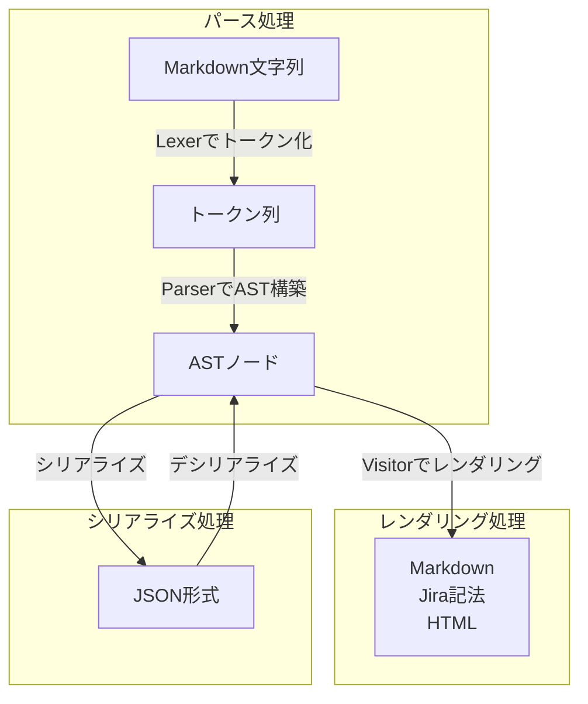
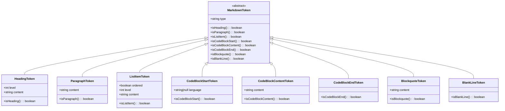
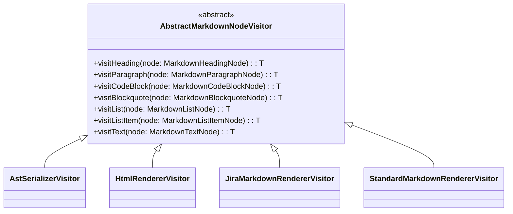

# Markdown Parser モジュール構成

このディレクトリは、標準MarkdownおよびJira記法に対応したMarkdownパーサーを構築するためのコンポーネント群です。

---

## 処理フロー概要

Markdownパーサーは、入力されたMarkdownを解析し、AST（抽象構文木）を生成してレンダリングやシリアライズを行います。以下に処理フローを示します。

### 処理の詳細

1. **パース処理**
   - **入力**: Markdown形式の文字列。
   - **処理**:
     1. Lexer（`StandardLexer` または `JiraLexer`）を使用して、Markdown文字列をトークン列に変換。
     2. Parser（`StandardParser` または `JiraParser`）を使用して、トークン列からAST（`MarkdownBlockNode[]`）を構築。
   - **出力**: AST（Markdownの構造を表すノードの配列）。

2. **レンダリング処理**
   - **入力**: AST（`MarkdownBlockNode[]`）。
   - **処理**:
     1. Visitorパターンを使用して、ASTを特定の形式に変換。
        - `StandardMarkdownRendererVisitor`: 標準Markdown形式に変換。
        - `JiraMarkdownRendererVisitor`: Jira記法に変換。
        - `HtmlRendererVisitor`: HTML形式に変換。
     2. 各ノードの`accept`メソッドを呼び出し、Visitorがノードを処理。
   - **出力**: 指定された形式の文字列（Markdown、Jira記法、HTML）。

3. **シリアライズ処理**
   - **入力**: AST（`MarkdownBlockNode[]`）。
   - **処理**:
     1. `AstSerializerVisitor` を使用して、ASTをシリアライズ可能なJSON形式（`SerializedMarkdownNode[]`）に変換。
     2. JSON形式のデータを保存または転送。
   - **出力**: JSON形式のデータ。

4. **デシリアライズ処理**
   - **入力**: シリアライズされたJSON形式のデータ（`SerializedMarkdownNode[]`）。
   - **処理**:
     1. `AstDeserializerVisitor` を使用して、JSONデータをAST（`MarkdownBlockNode[]`）に復元。
   - **出力**: AST。

このフローにより、Markdownの解析、変換、保存、復元が柔軟に行えるようになっています。

---

## 📚 構成概要（Mermaid図）
### 🔹 トークン構造
Markdown文字列のパース処理は、まず トークン化フェーズ から始まります。
この段階では、Markdownの1行1行を解析して、対応する意味を持った MarkdownToken を生成します。

各トークンは共通の基底クラス MarkdownToken を継承しており、種類ごとの判定メソッド（例: isHeading()）を持っています。

#### 主なトークンの種類：
| トークン種別                  | 説明                               |
| ----------------------- | -------------------------------- |
| `HeadingToken`          | `# 見出し` に該当する行。レベルやテキスト内容を保持します。 |
| `ParagraphToken`        | 通常のテキスト行。段落として扱われる行を対象とします。      |
| `ListItemToken`         | `- リスト` や `1. 番号付きリスト` に該当する行。   |
| `CodeBlockStartToken`   | \`\`\`\`\` などコードブロックの開始を示す行。     |
| `CodeBlockContentToken` | コードブロック内部の1行。                    |
| `CodeBlockEndToken`     | コードブロックの終了を示す行。                  |
| `BlockquoteToken`       | `> 引用` に該当する行。                   |
| `BlankLineToken`        | 空行。段落や構造の区切りとして扱われます。            |

### 🔸 ASTノード構造
トークン列から構築されたデータは、AST（抽象構文木）ノードとして表現されます。
これはMarkdown文書の階層的な構造を持つ木構造であり、各ノードは自身の子ノードを持つことでネストされた構造を再現します。

```mermaid
classDiagram
    direction TB

    %% ASTノード
    class MarkdownNode {
        <<abstract>>
        +accept<T>(visitor: AbstractMarkdownNodeVisitor<T>): T
    }

    class MarkdownBlockNode {
        <<abstract>>
    }

    class MarkdownInlineNode {
        <<abstract>>
    }

    MarkdownNode <|-- MarkdownBlockNode
    MarkdownNode <|-- MarkdownInlineNode

    class MarkdownHeadingNode {
        +int level
        +MarkdownInlineNode[] children
        +accept<T>(visitor: AbstractMarkdownNodeVisitor<T>): T
    }

    class MarkdownParagraphNode {
        +MarkdownInlineNode[] children
        +accept<T>(visitor: AbstractMarkdownNodeVisitor<T>): T
    }

    class MarkdownListNode {
        +boolean ordered
        +MarkdownListItemNode[] items
        +accept<T>(visitor: AbstractMarkdownNodeVisitor<T>): T
    }

    class MarkdownListItemNode {
        +MarkdownBlockNode[] children
        +accept<T>(visitor: AbstractMarkdownNodeVisitor<T>): T
    }

    class MarkdownBlockquoteNode {
        +MarkdownBlockNode[] children
        +accept<T>(visitor: AbstractMarkdownNodeVisitor<T>): T
    }

    class MarkdownCodeBlockNode {
        +string|null language
        +string content
        +accept<T>(visitor: AbstractMarkdownNodeVisitor<T>): T
    }

    class MarkdownTextNode {
        +string content
        +accept<T>(visitor: AbstractMarkdownNodeVisitor<T>): T
    }

    %% 継承関係
    MarkdownBlockNode <|-- MarkdownHeadingNode
    MarkdownBlockNode <|-- MarkdownParagraphNode
    MarkdownBlockNode <|-- MarkdownListNode
    MarkdownBlockNode <|-- MarkdownListItemNode
    MarkdownBlockNode <|-- MarkdownBlockquoteNode
    MarkdownBlockNode <|-- MarkdownCodeBlockNode
    MarkdownInlineNode <|-- MarkdownTextNode
```

#### ノードの分類と役割：
| ノード種別                    | 説明                            |
| ------------------------ | ----------------------------- |
| `MarkdownNode`           | 全てのノードの基底クラス（抽象）。             |
| `MarkdownBlockNode`      | 段落・リスト・見出しなどのブロック要素。          |
| `MarkdownInlineNode`     | テキストなど、ブロック内に内包されるインライン要素。    |
| `MarkdownHeadingNode`    | 見出し。レベルと子ノード（インライン）を持ちます。     |
| `MarkdownParagraphNode`  | 段落。インラインノードの配列を子として持ちます。      |
| `MarkdownListNode`       | リスト。順序有無やリスト項目ノードの配列を持ちます。    |
| `MarkdownListItemNode`   | リスト項目。中にさらにブロック要素を含めることができます。 |
| `MarkdownBlockquoteNode` | 引用。子ブロックを含むことができます。           |
| `MarkdownCodeBlockNode`  | コードブロック。言語指定とコンテンツ文字列を保持します。  |
| `MarkdownTextNode`       | プレーンテキスト。インラインノードの一種です。       |

### 🔸 Visitor構造
ASTノードを処理してHTMLなどの出力を生成するには、Visitorパターンが使われています。
各ノードは accept() メソッドを通じてVisitorを受け入れ、Visitorはノードの種類に応じた処理を実行します。

#### 実装されているVisitor：
| Visitor名                          | 出力内容                |
| --------------------------------- | ------------------- |
| `HtmlRendererVisitor`             | HTML形式に変換           |
| `JiraMarkdownRendererVisitor`     | Jira記法に変換           |
| `StandardMarkdownRendererVisitor` | 標準Markdownに変換       |
| `AstSerializerVisitor`            | JSONにシリアライズ可能な形式に変換 |

